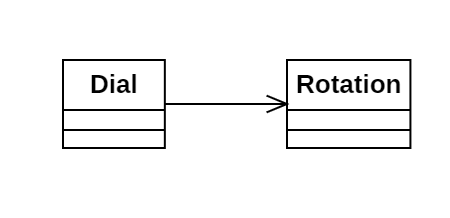

# Día 1a - *Secret Entrance*

Implementación de un dial que realiza una serie de rotaciones. El dial debe conocer su posición tras rotarlo, 
y poder contar el número de veces que la rotación lo deja en 0.

## Modelado conceptual

## Técnicas comunes

A continuación proponemos ejemplos en este día de las técnicas y líneas prinicipales del proyecto.

### Patrones creacionales
* **Factory Method:** usado tanto en la clase Dial (`Dial.create()`) como en la clase Rotation (`Rotation.from(String order)`).

### Lógica estructural
* **Principio de Responsabilidad Única (SRP):**
  * *Dial*: Responsable de almacenar su estado y normalizar la posición de acuerdo con su punto inicial y su tamaño.
  * *Rotation*: Responsable de convertir las órdenes (*Strings*) a objetos utilizables por el Dial.
* **Alta Modularidad y Bajo Acoplamiento:** El Dial desconoce el formato de las órdenes de entrada, solo conoce objetos Rotation. Esto protege al sistema contra cambios en el formato del *input*.
* **Inmutabilidad**: Ambas clases implementadas son inmutables. Por ejemplo, rotar el dial implica crear un nuevo objeto de este tipo (como en `execute(String orders)` y `add(String... orders)`).

### Clean Code
* **Programación declarativa y funcional**: El uso de streams y Fluent APIs en los métodos facilita la comprensión del código y evita la complejidad ciclomática.
* **Good naming**: Los métodos desarrollados tienen nombres autoexplicativos, que promueven la abstracción.