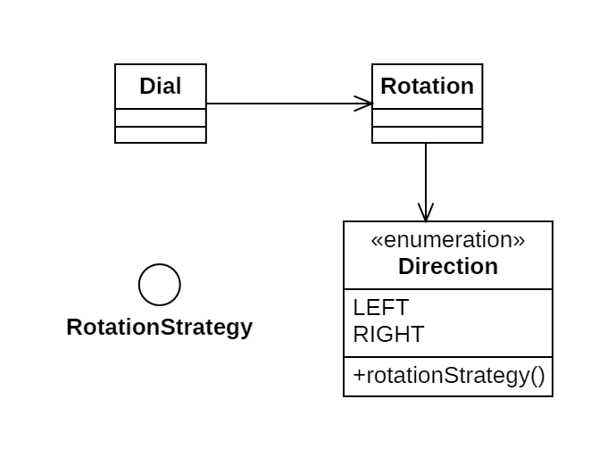

# Día 1b - *Secret Entrance*

Funcionalidad añadida al Dial, que le permite conocer cuántas veces ha pasado por 0 al realizar las rotaciones.

## Modelado conceptual

## Evolución del diseño

Estas son las modificaciones introducidas en este código frente a la primera parte:

* **Delegación de responsabilidades**: Se ha delegado la lógica de dirección al enumerado `Direction`. Esto permite separar las distintas responsabilidades para calcular los cruces en cero.

## Nuevas técnicas utilizadas

* **Replace Conditional with Polymorphism**: Al crear el enumerado `Direction`, evitamos usar condicionales, para ramificar los métodos en función de la dirección en la que rotemos el dial.
* **Tell, Don't Ask**: Ahora, en vez de solicitar los datos de la rotación para realizar los cálculos, le *ordena* a la rotación que los calcule ella misma. A su vez, la rotación delega el cálculo a direction.
* **Inyección de dependencia**: Inyectamos como dependencia en la creación de `Direction` la función que nos permite calcular los cruces en cero.
* **Principio de Sustitución de Liskov (LSP)**: Las clases externas a `Direction` desconocen cómo calcula los cruces en cero. Únicamente saben, mediante la interfaz funcional `RotationStrategy` y su método `calculateCrossings(int start, int magnitude)`, que tienen una forma de calcularlos. Esto garantiza la modularidad del código, pudiendo añadir cualquier nueva dirección sin cambiar el resto de la lógica.