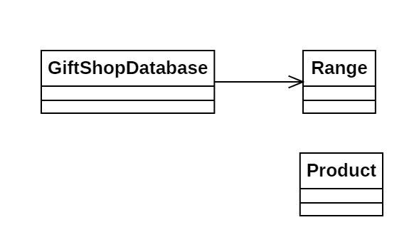

# Día 2b - *Gift Shop*

Modificación de la lógica de detección de IDs inválidos, pasando del mismo número repetido 2 veces (2a), al mismo número repetido 2 o más veces.

## Modelado conceptual

## Evolución del diseño
Únicamente se ha modificado en `Product` el método `isInvalid()`, cambiando el Regex de `^([0-9]+)\1$` a `^([0-9]+)\1+$`. 
De esta forma, al haber encapsulado la lógica de validación en esta clase, mantenemos el **Diseño por Contrato** intacto, demostrando
el bajo acoplamiento de las clases (pues el resto de clases han quedado intactas).