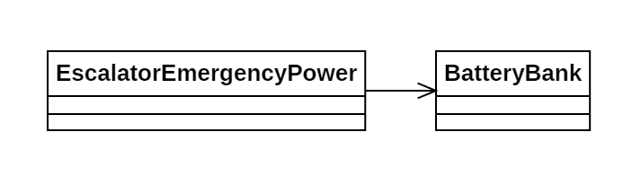

# Día 3a - *Lobby*

Implementación de las baterías de emergencia de las escaleras mecánicas. Se debe encontrar la combinación de 2 baterías por grupo que maximiza el *joltaje* del mismo.

## Modelado conceptual

## Técnicas comunes

A continuación proponemos ejemplos en este día de las técnicas y líneas prinicipales del proyecto.

### Patrones creacionales
* **Factory Method:** usado tanto en la clase BatteryBank (`BatteryBank.from(String bank)`) como en la clase EscalatorEmergencyPower (`EscalatorEmergencyPower.from(String banks)`).

### Lógica estructural
* **Principio de Responsabilidad Única (SRP):**
    * *EscalatorEmergencyPower*: Toma los resultados máximos de los distintos grupos de baterías que contiene y los suma.
    * *Range*: Sabe convertir la entrada a un objeto de su tipo. También sabe calcular el máximo *joltaje* en sus baterías.
* **Alta Modularidad y Bajo Acoplamiento:** *EscalatorEmergencyPower* confía en que el *BatteryBank* es capaz de transformar los datos de entrada y calcular el *joltage* máximo.
* **Inmutabilidad**: Todas las clases implementadas son inmutables.

### Clean Code
* **Programación declarativa y funcional**: Todos los métodos implementados hacen uso de streams y Fluent APIs, con el fin de evitar la complejidad ciclomática y facilitar la abstracción.
* **Good naming**: Los métodos desarrollados, como `bestFirstBatteryIndex()` y `bestSecondBatteryIndex()` tienen nombres autoexplicativos, que permiten reducir el problema a pasos pequeños y comprensibles.

## Otras técnicas utilizadas
* **Tell, Don't Ask**: El conjunto de baterías es capaz de calcular cuál es su máximo *joltage*. De esta forma, *EscalatorEmergencyPower* solo solicita a *BatteryBank* que lo calcule, llamando al método `maxJoltage()`, y evitando conocer la lógica detrás del cálculo del máximo.