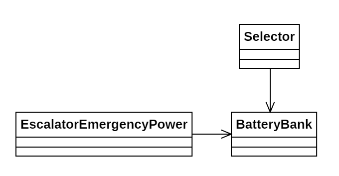

# Día 3b - *Lobby*

Modificación de los grupos de baterías para calcular el máximo como el grupo de 12 baterías que maximiza su *joltaje*.

## Modelado conceptual

## Evolución del diseño

Estas son las modificaciones introducidas en este código frente a la primera parte:

* **Delegación de responsabilidades**: Se ha delegado la lógica de iteración para buscar las 12 baterías a su *inner class* `Selector`. Esto permite separar las distintas responsabilidades para calcular el máximo *joltaje*.
* **Abstracción de la iteración**: Al añadir `BatteryBank.Selector`, se ha sustituido la gestión manual de los índices por un nuevo nivel de abstracción. De esta forma, y combinado con `Stream.iterate()` podemos iterar sobre el grupo de baterías de forma desacoplada.

## Nuevas técnicas utilizadas

* **Patrón Iterator**: Implementación del recorrido sobre el grupo de baterías por una clase interna iteradora.
* **Ocultación de información**: La *inner class* solo es visible dentro de BatteryBank, protegiendo sus detalles de implementación del resto de clases.
