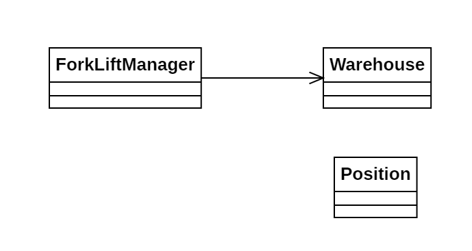

# Día 4a - *Printing Department*

Implementación un elevador que cuenta todos los rollos de papel accesibles en el almacén del departamento.

## Modelado conceptual

## Técnicas comunes

A continuación proponemos ejemplos en este día de las técnicas y líneas prinicipales del proyecto.

### Patrones creacionales
* **Factory Method:** usado tanto en la clase Warehouse (`Warehouse.from(String input)`) como en la clase ForkLiftManager (`ForkliftManager.with(String grid)`).

### Lógica estructural
* **Principio de Responsabilidad Única (SRP):**
    * *ForkliftManager*: Coordina las operaciones de filtrado de rollos de papel y conteo de rollos accesibles.
    * *Warehouse*: Gestiona el mapa del almacén: sabe convertir los datos de entrada a un objeto de su tipo, y cuándo un rollo es accesible.
    * *Position*: Únicamente responsable de la geometría. Sabe calcular cuáles son sus posiciones vecinas.
* **Alta Modularidad y Bajo Acoplamiento:** *ForkliftManager* no conoce las dimensiones del almacén, ni cómo se calculan los rollos accesibles. Simplemente delega a *Warehouse* los cálculos, llamando al método `isAccessible(Position position)`
* **Inmutabilidad**: Todas las clases implementadas son inmutables.

### Clean Code
* **Programación declarativa y funcional**: Todos los métodos implementados hacen uso de streams y Fluent APIs, con el fin de evitar la complejidad ciclomática y facilitar la abstracción. Se destaca el uso de streams de `Position`, combinados con `flatMap()`, para navegar por las celdas del almacén.
* **Good naming**: Los métodos desarrollados tienen nombres autoexplicativos.
* **Abstracción de Tipos**: la creación de la clase `Position` permite encapsular las coordenadas de cada celda del almacén. Esto facilita la legibilidad y mantenibilidad del código.

## Otras técnicas utilizadas
* **Tell, Don't Ask**: El almacén no expone su *grid*, sino que procesa su lógica internamente. Así, basta con que el `ForkliftManager` le indique lo que necesita, para que `Warehouse` lo haga por su cuenta. 