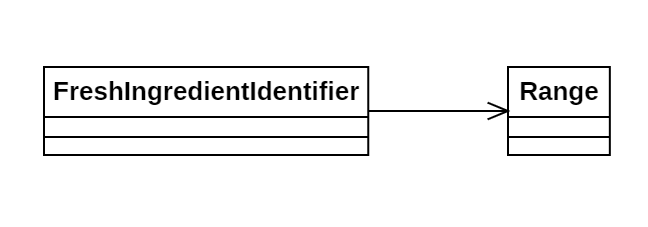

# Día 5a - *Cafeteria*

A través de una serie de rangos de IDs de ingredientes frescos, y una lista de ingredientes que verificar, debemos contar cuántos ingredientes están frescos.

## Modelado conceptual

## Técnicas comunes

A continuación proponemos ejemplos en este día de las técnicas y líneas prinicipales del proyecto.

### Patrones creacionales
* **Factory Method:** usado tanto en la clase FreshIngredientIdentifier (`FreshIngredientIdentifier.create(String ranges)`) como en la clase Range (`Range.from(String range)`).

### Lógica estructural
* **Principio de Responsabilidad Única (SRP):**
    * *FreshIngredientIdentifier*: Coordina la validación de los ingredientes frente a los rangos conocidos.
    * *Range*: Sabe convertir la entrada a un objeto de su tipo. Sabe calcular si el incluye un ID determinado.
* **Alta Modularidad y Bajo Acoplamiento:** *FreshIngredientIdentifier* no conoce el formato de los datos de entrada ni los detalles de las comparaciones. Delega todo esto a la clase `Range`.
* **Inmutabilidad**: Todas las clases implementadas son inmutables.

### Clean Code
* **Programación declarativa y funcional**: Todos los métodos implementados hacen uso de streams y Fluent APIs. Por ejemplo, el uso de `anyMatch()` en `isFresh(long i)` nos permite imitar lo que realizaría un bucle for, con *break* y variables temporales, sin introducir complejidad ciclomática.
* **Good naming**: Métodos como `isFresh(long i)` y `includes(long id)` promueven la auto-documentación del código.

## Otras técnicas utilizadas
* **Tell, Don't Ask**: La responsabilidad de validar el ID reside en `Range`. *FreshIngredientIdentifier* no conoce cómo se define un rango, solo le ordena que verifique la frescura del ingrediente.
* **Short-circuit Evaluation**: El uso de `anyMatch()` también permite optimizar el rendimiento sin dificultar la abstacción, pues desde que se encuentra un rango que valida el ingrediente se para el *pipeline*.