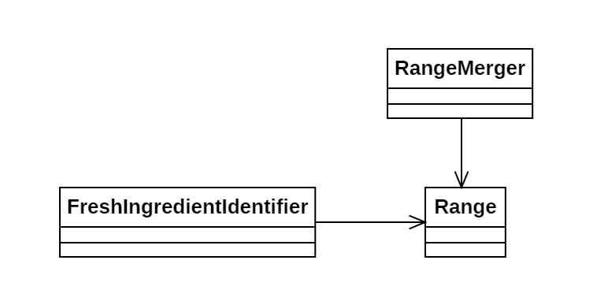

# Día 5b - *Cafeteria*

Ahora, a partir de la serie de rangos, debemos contar el total de ingredientes frescos contenidos en todos ellos. 
Se deben controlar los solapes entre rangos para no duplicar la cuenta de IDs.

## Modelado conceptual

## Evolución del diseño

Estas son las modificaciones introducidas en este código frente a la primera parte:

* **Fusión de rangos**: En vez de comprobar la validez de los distintos ingredientes, incluimos `RangeMerger` para unificar todos los rangos del *input*.
* **Preordenación de los rangos**: `Range` ahora es comparable. Esto nos permite preordenar los rangos de entrada en el stream, para facilitar la fusión.

## Nuevas técnicas utilizadas

* **Inmutabilidad**: Para fusionar rangos, `RangeMerger` crea una nueva instancia de él mismo. Así mantenemos el modelo inmutable y facilitamos el seguimiento de su evolución.
* **Reducción Personalizada**: Al personalizar la reducción del stream en `merge(List<Range> ranges)`, podemos crear la nueva lista de rangos fusionada sin añadir mutabilidad ni complejidad ciclomática.
* **Null Pattern**: La constante `Range.Null` elimina la necesidad de comprobaciones de nulidad, haciendo que el código sea más robusto y legible.