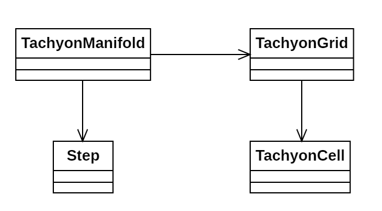

# Día 7b - *Laboratories*

Ahora, con la misma propagación del láser, debemos contar cuántos los caminos posibles de propagación.

## Modelado conceptual

## Evolución del diseño

Estas son las modificaciones introducidas en este código frente a la primera parte:

* **Modificación de estados**: `Step` ya no contiene una lista de `TachyonCell`, sino el número de caminos contados hasta esa fila. Esto nos permite usar Programación Dinámica con una aproximación *bottom-up*, manteniendo a su vez legibilidad y eficiencia en el código.

Puesto que no hemos cambiado la estructura inherente del código sino que únicamente modificamos la lógica de propagación, hemos demostrado la modularidad del código.