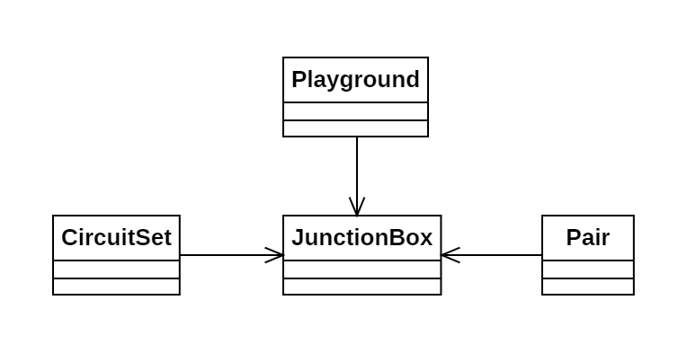

# Día 8a - *Playground*

Simulación del cableado de distintas cajas de conexión. Se deben conectar las cajas más cercanas e identificar los circuitos de conexiones más grandes.

## Modelado conceptual

## Técnicas comunes

A continuación proponemos ejemplos en este día de las técnicas y líneas prinicipales del proyecto.

### Patrones creacionales
* **Factory Method:** usado en todas las clases (`CircuitSet.from(Stream<JunctionBox> boxes)`, `Playground.with(String boxes)`, `JunctionBox.from(String line)` y `Pair.of(JunctionBox box1, JunctionBox box2)`).

### Lógica estructural
* **Principio de Responsabilidad Única (SRP):**
    * **Playground**: Toma las decisiones de conexión de cajas en base a las distancias de los `Pair`.
    * **CircuitSet**: Responsable de unir los circuitos de las cajas.
    * **Pair**: Conoce la distancia que separa a 2 cajas.
    * **JunctionBox**: Conoce su ubicación espacial.
* **Alta Modularidad y Bajo Acoplamiento:** El cálculo de distancias `Pair` es independiente de la agrupación de circuitos `CircuitSet` y de la toma de decisiones `Playground`. Esto permite cambiar cualquiera de estas tres características sin afectar al resto del sistema.
* **Inmutabilidad**: Todas las clases implementadas son inmutables.

### Clean Code
* **Programación declarativa y funcional**: Todos los métodos implementados hacen uso de streams y Fluent APIs, evitando complejidad ciclomática.
* **Good naming**: Los nombres utilizados para los métodos hacen que el código sea legible y auto-explicativo.

## Otras técnicas utilizadas
* **Tell, Don't Ask**: `Playground` ordena a `CircuitSet` que una circuitos, y a `Pair` que calcule distancias. No se encarga él de realizar toda esa lógica.
* **Inmutabilidad en la fusión**: La unión de los distintos circuitos genera un nuevo CircuitSet inmutable e independiente del generado en la etapa anterior. De esta forma, también aseguramos la trazabilidad del código.
