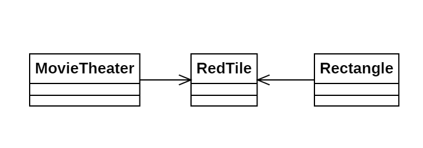

# Día 9a - *Movie Theater*

Representamos un cine en el que tenemos unas baldosas rojas en el suelo. Debemos encontrar el rectángulo de mayor área formado por dos losas rojas

## Modelado conceptual

## Técnicas comunes

A continuación proponemos ejemplos en este día de las técnicas y líneas prinicipales del proyecto.

### Patrones creacionales
* **Factory Method:** Utilizado en *RedTile* (`RedTile.of(String tile)`)y en *MovieTheater* (`MovieTheater.with(String tiles)`).

### Lógica estructural
* **Principio de Responsabilidad Única (SRP):**
  * **MovieTheater**: Responsable de la lógica, y la identificación del rectángulo con área máxima.
  * **Rectangle**: Conoce la geometría del rectángulo y su cálculo de superficie.
  * **RedTile**: Solo gestiona la ubicación espacial de una losa. 
* **Alta Modularidad y Bajo Acoplamiento:** Las propiedades geométricas son independientes a la lógica de `MovieTheater`, por lo que cualquier modificación de una parte no afectaría a la otra.
* **Inmutabilidad**: Todas las clases implementadas son inmutables.

### Clean Code
* **Programación declarativa y funcional**: Todos los métodos implementados hacen uso de streams y Fluent APIs, evitando bucles anidados para computar, por ejemplo, el producto cartesiano de las losas.
* **Good naming**: Los nombres utilizados para los métodos hacen que el código sea legible y auto-explicativo. Algunos ejemplos son `rectanglesStartingAt(Integer i)` o `largestArea()`.

## Otras técnicas utilizadas
* **Tell, Don't Ask**: `MovieTheater` no calcula manualmente el área de los rectángulos en base a sus coordenadas. En cambio, delega ese cálculo a la clase `Rectangle`, que tiene funcionalidad propia.
* **Null Pattern**: Se usan los atributos estáticos `Rectangle.Null` y `RedTile.Null` para evitar comprobaciones de nulidad sobre estos objetos, reduciendo la ofuscación del código.