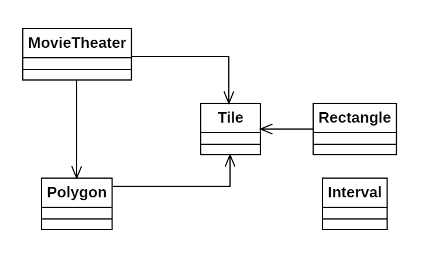

# Día 9b - *Movie Theater*

Todas las baldosas rojas del suelo ahora están unidas por líneas rectas de baldosas verdes, formando un polígono. Tenemos que volver a encontrar el rectángulo formado por dos baldosas rojas de mayor área, pero ahora debe estar completamente contenido dentro del polígono de losas verdes.

## Modelado conceptual

## Evolución del diseño

Estas son las modificaciones introducidas en este código frente a la primera parte:

* **Clase `Polygon`**: Creamos una nueva clase llamada Polygon, siguiendo el Principio de Responsabilidad única, que conoce su geometría, y sabe calcular si un rectángulo se encuentra contenido en él.
* **Clase `Interval`**: Para optimizar el código manteniendo el paradigma de la programación declarativa, incluimos la clase `Interval`, que conoce cuándo un punto se encuentra contenido en él.

## Nuevas técnicas utilizadas

* **Patrón Memoize**: Para que la validación de la contención del rectángulo en el polígono sea más rápida, utilizamos el patrón memoize. De esta forma, precalculamos y almacenamos los vértices y aristas del polígono, evitando la lenta re-computación de la geometría en la comprobación.