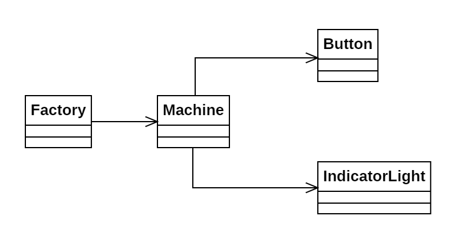

# Día 10a - Factory

Nos hallamos ante una fábrica con distintas máquinas. Cada una tiene unos botones que se pueden pulsar para encender o apagar unas luces. Debemos encontrar el mínimo número de botones que llevan a una configuración de luces determinada.

## Modelado conceptual

## Técnicas comunes

A continuación proponemos ejemplos en este día de las técnicas y líneas prinicipales del proyecto.

### Patrones creacionales
* **Factory Method:** Utilizado en todas las clases (`Factory.with(String machines)`, `Machine.from(String machine)`, `Button.from(String machine, int length)`, `IndicatorLight.from(String lightDiagram)`)

### Lógica estructural
* **Principio de Responsabilidad Única (SRP):**
  * **IndicatorLight**: Responsable de convertir el diagrama de luces de entrada a un objeto de este tipo.
  * **Button**: Convierte la entrada y almacena una máscara de bits referente a las luces afectadas por ese botón (p. ej el botón (0, 3) resultaría en un valor de botón 9 (1001 en decimal)).
  * **Machine**: Realiza la búsqueda de la combinación óptima de botones. 
  * **Factory**: Centraliza los resultados obtenidos en todas las máquinas.
* **Alta Modularidad y Bajo Acoplamiento:** El sistema de representación y el algoritmo de búsqueda están totalmente desacoplados. Una modificación de uno no corrompería el otro (siempre y cuando se mantenga el diseño por contrato).
* **Inmutabilidad**: Todas las clases implementadas son inmutables.

### Clean Code
* **Programación declarativa y funcional**: Todos los métodos implementados hacen uso de streams y Fluent APIs. Esto nos permite, aún en un código que resuelve problemas complejos, mantener métodos cortos y comprensibles.
* **Good naming**: Los nombres utilizados para los métodos facilitan la lectura del código.

## Otras técnicas utilizadas
* **Tell, Don't Ask**: `Factory` delega la búsqueda a `Machine`, que a su vez delega el cómputo de las máscaras a `Button`. Todas las clases tienen métodos relativos a la funcionalidad que les compete.