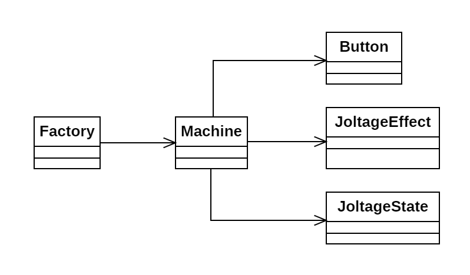

# Día 10b - *Factory*

Evolución del sistema de control de la fábrica, que ahora busca un *joltaje* a alcanzar con la configuración de botones mínima.
  
Para alcanzar una velocidad del código asumible (pues los *joltajes* a alcanzar son demasiado elevados) esta solución está inspirada en [este algoritmo](https://www.reddit.com/r/adventofcode/comments/1pk87hl/2025_day_10_part_2_bifurcate_your_way_to_victory/). 
Naturalmente, únicamente se ha tomado la idea como punto de partida. El algoritmo ha sido adaptado al paradigma de programación declarativa.

## Modelado conceptual

## Evolución del diseño

Estas son las modificaciones introducidas frente a la primera parte:

* **Clases JoltageEffect y JoltageState**: Adaptación del problema de la parte 1 a la parte 2. Incluimos el objetivo de *joltaje* en `JoltageState`. Este objetivo se irá reduciendo conforme nos adentremos en la búsqueda. `JoltageEffect` se utiliza para precomputar el efecto sobre el *joltaje* al pulsar cada una de las combinaciones posibles de botones. Esto permite acelerar la búsqueda.
* **Divide y vencerás**: Para resolver el problema, aplicamos la técnica de reducción, para ir convirtiendo el problema en uno más pequeño y manejable. Una vez resueltos los subproblemas, se combinan para resultar en la resolución del problema padre. Realizamos esto con streams y recursividad.

## Nuevas técnicas utilizadas

* **Patrón Memoize**: Para que la búsqueda sea más rápida, utilizamos el patrón memoize. En este código lo implementamos en `Machine`, en 2 ocasiones: en `availableEffects`, que precomputa todos los posibles `JoltageEffects` antes de comenzar con la búsqueda; y `knownJoltageStates`, que almacena los caminos mínimos conocidos para evitar re-calcularlos. Estos dos campos aceleran considerablemente la búsqueda de la solución.