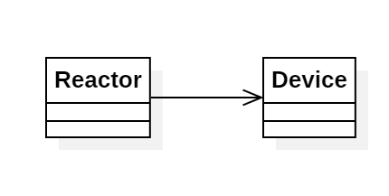

# Day 11a - *Reactor*

Representación de un grafo de conexiones entre dispositivos. Debemos buscar el número de caminos que unen los dispositivos *you* y *out*.

## Modelado conceptual

## Técnicas comunes

A continuación proponemos ejemplos en este día de las técnicas y líneas prinicipales del proyecto.

### Patrones creacionales
* **Factory Method:** Utilizado tanto en `Reactor` (`Reactor.from(String devices)`) como en `Devices` (`Device.with(String name)`).

### Lógica estructural
* **Principio de Responsabilidad Única (SRP)**:
    * **Device**: Responsable de, a partir de los datos de entrada, construir y almacenar identidad y sus sucesores.
    * **Reactor**: Responsable del algoritmo de búsqueda.
* **Alta Modularidad y Bajo Acoplamiento**: De nuevo, la lógica de representación (`Device`) y búsqueda (`Reactor`) son independientes..
* **Inmutabilidad**: Todos las clases implementadas son inmutables.

### Clean Code
* **Programación declarativa y funcional**: Todos los métodos implementados hacen uso de streams y Fluent APIs, incluso en el problema de búsqueda (en donde suelen predominar los bucles y las variables temporales).
* **Good naming**: Métodos como `nPathsToOut` y `isOutput` permiten una abstracción y lectura cómoda del código.

## Otras técnicas utilizadas
* **Tell, Don't Ask**: Para gestionar los sucesores de un dispositivo y saber si es el dispositivo objetivo, basta con que `Reactor` solicite esa información a `Device`.