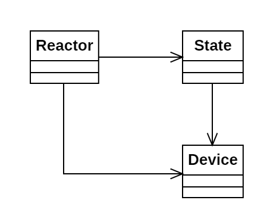

# Día 11b - *Reactor*

Ahora debemos encontrar el número de caminos que unen *svr* y *out*, pasando por el conversor analógico-digital (*dac*), y el transformador de Fourier (*fft*)

## Modelado conceptual

## Evolución del diseño

En este ejercicio y frente al anterior se introduce la clase `State`. En ella almacenamos el estado de la ruta en cada paso. Además de conocer el dispositivo actual, rastrea si en ese camino ya se han visitado  `dac` y `fft`. Su método `next()` permite obtener el siguiente estado.

## Nuevas técnicas utilizadas

* **Inmutabilidad de los estados**: El método `next()` en la clase `State` devuelve un nuevo estado por cada dispositivo al que nos movemos.
* **Patrón Memoize**: Puesto que tenemos una probabilidad alta de obtener dos veces el mismo estado, utilizamos el patrón memoize en el campo `savedStates` del reactor. Así, obtenemos una solución rápida y evitamos recomputar infinitamente los mismos caminos.