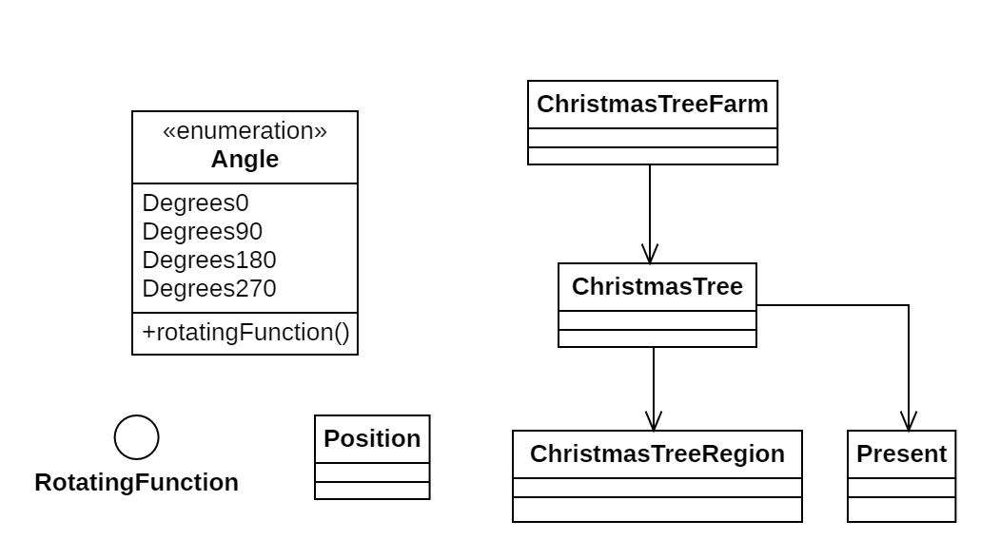

# Día 12a - *The Christmas Tree*

En este desafío nos trasladamos a una granja de árboles de Navidad. Dada una lista de regalos (con formas irregulares) y una región rectangular bajo los árboles, debemos determinar si es posible colocar todos los regalos de forma que queden completamente contenidos en la región y sin solaparse entre ellos.

## Modelado conceptual

## Técnicas comunes

A continuación proponemos ejemplos en este día de las técnicas y líneas principales del proyecto.

### Patrones creacionales
* **Factory Method**: Utilizado en `ChristmasTreeFarm` (`ChristmasTreeFarm.with(String farm)`), `ChristmasTree` (`ChristmasTree.with(...)`), `ChristmasTreeRegion` (`ChristmasTreeRegion with(int width, int height)`) y `Present` (`Present.with(String structure)`).

### Lógica estructural
* **Principio de Responsabilidad Única (SRP)**:
    * **ChristmasTreeFarm**: Responsable de interpretar los datos de entrada y coordinar las resoluciones de cada árbol.
    * **ChristmasTree**: Responsable de algoritmo de búsqueda.
    * **ChristmasTreeRegion**: Responsable de la gestión y la lógica del espacio de la región.
    * **Present**: Encapsula la forma y la lógica del regalo. Es capaz de generar todas sus posibles orientaciones (rotaciones y simetrías).
    * **Angle**: Responsable del mapeo de la rotación de coordenadas (0º, 90º, 180º, 270º).
    * **Position**: Representa un punto en el espacio y gestiona su propia traslación.
* **Alta Modularidad y Bajo Acoplamiento**: La geometría está presente en `Present`, `Angle` y `ChristmasRegion`. El motor de búsqueda se encuentra en `ChristmasTree`, y el coordinador es `ChristmasTreeFarm`. Ninguno de estos tres módulos depende de los otros. Esto demuestra la modularidad del código
* **Inmutabilidad**: Todas las clases implementadas son inmutables.

### Clean Code
* **Programación declarativa y funcional**: Uso intensivo de Streams para rotar regalos, encontrar puntos de anclaje válidos (`validAnchorPoints`) y explorar combinaciones.
* **Good naming**: Métodos como `canFitPresent(Present)`, `isKnownFailure()` y `allOrientations()` hacen que el código sea fácilmente comprensible.

## Otras técnicas utilizadas

* **Tell, Don't Ask**: `ChristmasTree` solicita a `ChristmasTreeRegion` que coloque un regalo. De esta forma, la región es responsable de su propia lógica. Podemos realizar el mismo símil con `Present`, pues calcula sus propias rotaciones.
* **Inmutabilidad de la región**: Al intentar colocar un regalo en la región, `ChristmasTreeRegion` devuelve un nuevo objeto de su tipo. Esto permite la inmutabilidad y trazabilidad del modelo.
* **Replace Conditional With Polymorphism**: El uso del enumerado `Angle` permite deshacernos de condicionales en `Present`, que verificaran el tipo de rotación.
* **Inyección de dependencia**: `Angle` conoce cómo debe operar gracias a una inyección de dependencia. La función de su campo rotatingFunction indica cómo debe mapear una celda a su versión rotada.
* **Patrón Memoize**: Para optimizar la búsqueda, se utiliza un el campo `failedStates` que almacena las configuraciones fallidas. Esto evita re-explorar caminos que ya se demostraron irresolubles.